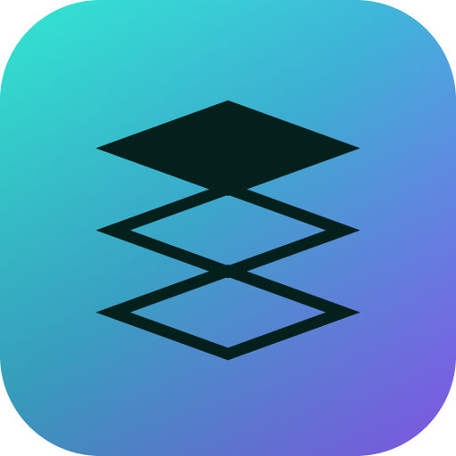
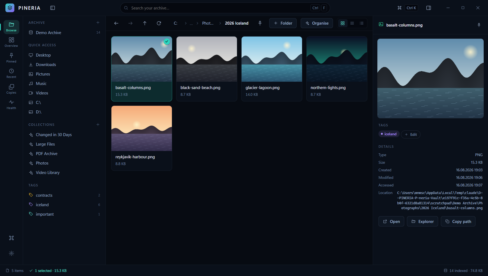
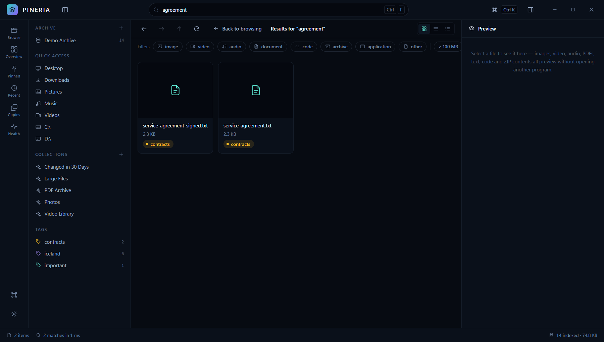
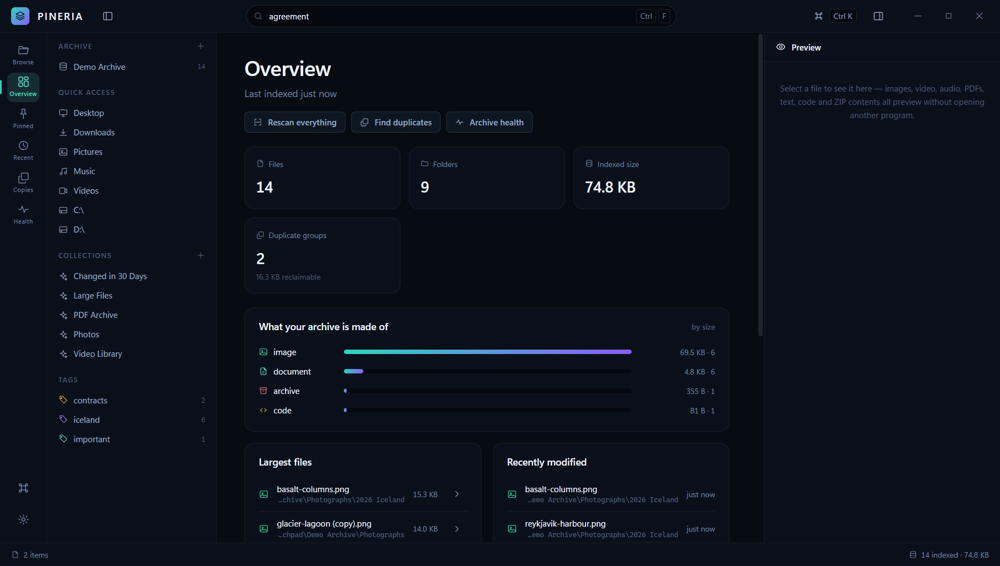
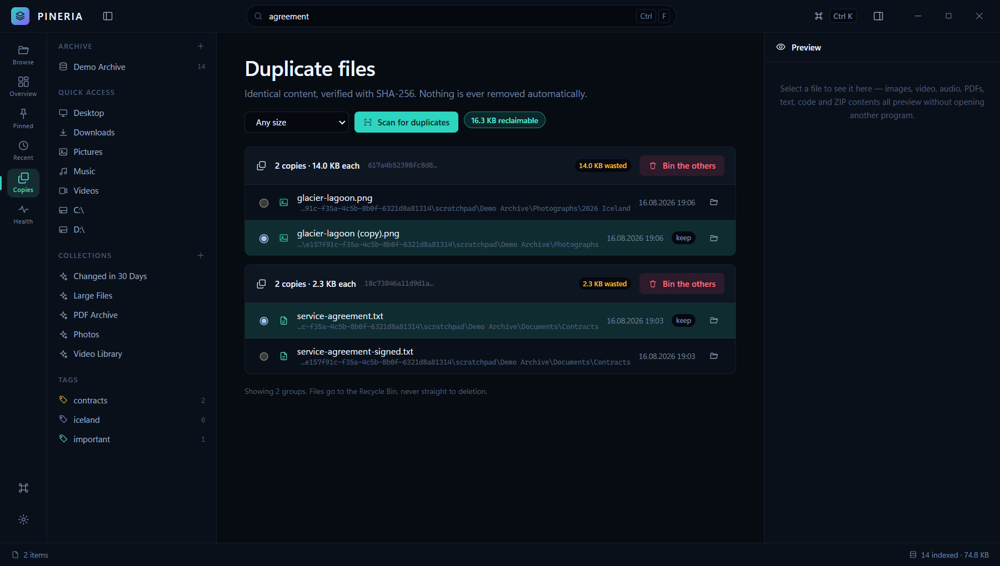
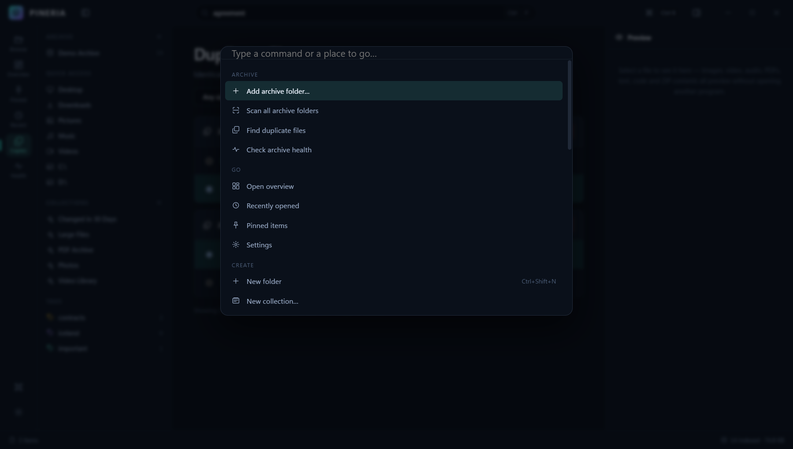
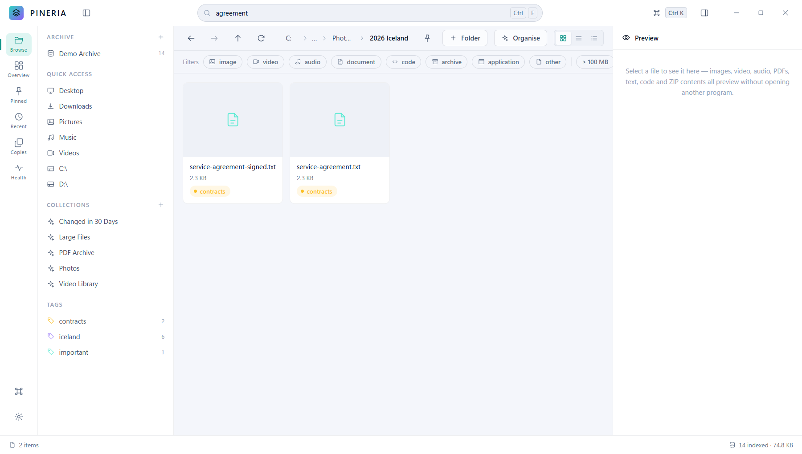

<div align="center" markdown="1">



# Pineria

**Your digital memory, indexed.**

A local-first archive and digital library manager for Windows.
Find, tag and reorganise a lifetime of files — without moving them to anyone's cloud.

[](https://github.com/EnemyOfTheScorpion/pineria/releases/latest)
[](https://github.com/EnemyOfTheScorpion/pineria/releases)
[](#requirements)
[](LICENSE)
[](https://enemyofthescorpion.github.io/pineria/)

**[⬇ Download for Windows](https://github.com/EnemyOfTheScorpion/pineria/releases/latest)** · [Quick start](docs/quick-start.md) · [FAQ](docs/faq.md) · [Handbook](https://enemyofthescorpion.github.io/pineria/)

</div>



---

## The problem

You have an archive. Fifteen years of photos, downloads nobody ever sorted, scanned documents,
project folders, three external drives with overlapping copies of the same thing. You know
roughly what is in there. You cannot find anything.

Windows Search gives up. Cloud services want you to upload it all first. File managers show you
one folder at a time and tell you nothing about the shape of what you have.

**Pineria indexes your folders where they already are** and gives you a way to search, understand
and reorganise them — reading only, until you decide otherwise.

## What makes it different

- **Nothing leaves your machine.** No account, no sync, no telemetry, no crash reporting. Pineria
  has no network client at all — not disabled, *not implemented*. Read [PRIVACY.md](PRIVACY.md).
- **Your folders stay yours.** Indexing is read-only. Nothing is copied, renamed or reorganised as
  a side effect of a scan. Your structure is preserved exactly as it is.
- **It refuses to lose your files.** Deletion goes to the Recycle Bin — there is no permanent-delete
  path in the application. Moves and copies never silently overwrite. Every operation can be undone.
- **It is fast on real archives.** A 12,000-file folder opens in about a second and stays smooth
  while you scroll it.
- **Free, with no strings.** Every feature, no trial, no upgrade prompt, no advertising.

---

## What you can do with it

### Find anything, instantly

Full-text search over every file name and path in your archive, combined with filters for type,
size, date, tag and folder. Results in milliseconds, not minutes.



### Understand what you actually have

An overview of your archive by file type, size, the largest files, what changed recently, and how
much space duplicates are wasting.



### Reclaim space from duplicates

Finds byte-for-byte identical files by comparing size first, then a partial fingerprint, then a
full SHA-256 checksum — so most of your archive is never even read from disk. It shows you what is
reclaimable and lets *you* decide. Nothing is ever deleted for you.



### Reorganise a messy archive by hand

The **Archive Organizer** is a dedicated workspace: your current folders on the left, the structure
you want on the right, and a short drag across the middle to move files. Queue up hundreds of moves,
review them, then apply them all at once — and undo the whole batch with one `Ctrl+Z` if you change
your mind.

If your computer crashes mid-move, Pineria knows exactly where it got to and offers to finish, roll
back or leave things as they are. [Read more →](docs/archive-organizer.md)



### Tag files without moving them

Labels that live alongside your folder structure instead of fighting it. A file can carry as many
tags as you like, and tags follow it when you move or rename it inside Pineria.

### Preview without opening anything

Images, video, audio, PDFs, text, code, spreadsheets and the contents of ZIP archives — all in the
app, without launching another program.

### Work at the speed of your keyboard

`Ctrl+K` opens a command palette that reaches everything. `Ctrl+F` searches. Every action worth
doing twice has a shortcut, and every shortcut is discoverable.

### Light and dark

Dark is the design's home ground. Light is a genuine re-grounding, not an inverted palette.



---

## Download

**[⬇ Get the latest release](https://github.com/EnemyOfTheScorpion/pineria/releases/latest)**

| File | Best for |
| --- | --- |
| `Pineria.Setup.0.1.2.exe` | Most people. Installs normally, adds Start Menu and desktop shortcuts, uninstalls cleanly. |
| `Pineria.Portable.0.1.2.exe` | Running from a USB stick, or trying it without installing anything. |

Every release ships a `checksums.txt` so you can verify what you downloaded:

```powershell
Get-FileHash ".\Pineria.Setup.0.1.2.exe" -Algorithm SHA256
```

> **Windows SmartScreen will warn you on first run.** Pineria is not code-signed — a certificate
> costs several hundred dollars a year, which a free application does not have. Choose
> **More info → Run anyway**, or verify the checksum above first if you would rather not take it
> on trust. [Why? →](docs/faq.md#why-does-windows-warn-me)

### Requirements

- Windows 10 or 11, 64-bit
- About 250 MB of disk space
- **Nothing else.** No Node.js, no .NET, no Python, no runtime to install. Everything Pineria needs
  is inside the executable.

---

## Documentation

Everything below is in this repository, and the same pages are readable as a site at
**[enemyofthescorpion.github.io/pineria](https://enemyofthescorpion.github.io/pineria/)**.

| | |
| --- | --- |
| [Installation](docs/installation.md) | Installing, updating, uninstalling, and where your data lives |
| [Quick start](docs/quick-start.md) | Your first ten minutes |
| [Features](docs/features.md) | What everything does, and where the limits are |
| [Archive Organizer](docs/archive-organizer.md) | The reorganisation workspace in depth |
| [FAQ](docs/faq.md) | The questions people actually ask |
| [Troubleshooting](docs/troubleshooting.md) | When something goes wrong |
| [Privacy](PRIVACY.md) | Exactly what Pineria reads and writes |
| [Changelog](CHANGELOG.md) | What changed in each release |
| [Contributing](CONTRIBUTING.md) | Reporting a bug well, and what can be sent as a pull request |

---

## Support the project

Pineria is free and always will be. It is built and maintained by one person, in their own time,
with no company behind it and no data being sold on the side.

If it saved you an afternoon of sorting files, you can say thank you:

**[❤ Sponsor Pineria](https://github.com/sponsors/EnemyOfTheScorpion)**

Donations are entirely voluntary. They unlock nothing, because there is nothing locked.

Other ways to help, all free:

- ⭐ **Star this repository** — it is the single biggest thing for helping other people find it
- 🐛 **[Report a bug](https://github.com/EnemyOfTheScorpion/pineria/issues/new?template=bug_report.yml)**
  when something breaks
- 💡 **[Suggest a feature](https://github.com/EnemyOfTheScorpion/pineria/issues/new?template=feature_request.yml)**
- 💬 Tell someone who is drowning in their own downloads folder

---

## Roadmap

Honest about what does not exist yet:

- **macOS and Linux builds.** Windows only today; the safety rules are written against Windows paths.
- **Automatic updates.** Updating means downloading the next release.
- **A filesystem watcher.** The index updates when you scan, not the moment a file changes.
- **Content search.** Pineria searches names and paths, not the text inside documents.
- **Code signing**, to stop the SmartScreen warning.

## Licence

Free to use, at home and at work, on as many machines as you like — see [LICENSE](LICENSE).

Pineria is proprietary freeware: the application is given away, the source code is not published.
It is built on [Electron](https://www.electronjs.org/), Chromium and Node.js, whose own open-source
licences ship with the application.

---

<div align="center" markdown="1">
<sub>Built for people who would rather own their archive than rent it.</sub>
</div>
